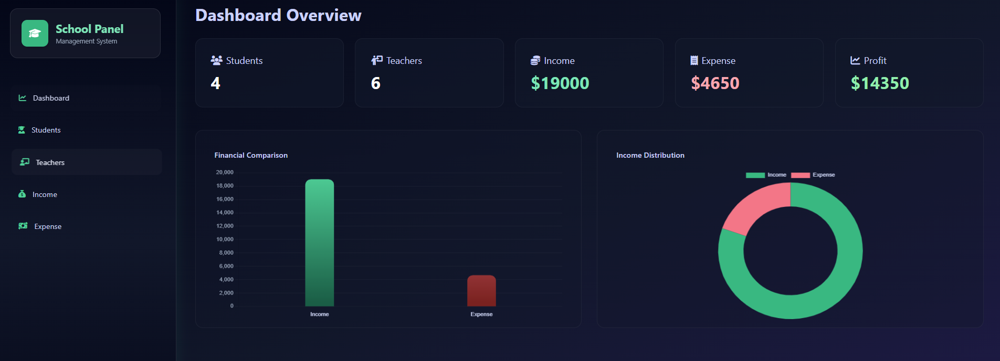

# 🏫 School Management System (MIS Project)


---

## 🚀 Features

- 👨‍🎓 Student Management (Add, View, Delete)
- 👨‍🏫 Teacher Management (CRUD operations)
- 💰 Income Management
- 💸 Expense Management
- 📊 Dashboard with live statistics
- 📈 Profit calculation (Income - Expense)
- 🎨 Modern UI with Tailwind CSS
- 🧠 Dynamic data rendering using EJS

---

## 🛠 Tech Stack

- Node.js
- Express.js
- MongoDB + Mongoose
- EJS (Templating Engine)
- Tailwind CSS
- Font Awesome

---

## 📂 Project Structure

models/ → Database schemas
controllers/ → Logic handling
routes/ → API routes
views/ → EJS frontend pages
partials/ → Sidebar & reusable UI
config/ → DB connection
app.js → Main server file

---

## ⚙️ Installation

```bash
git clone https://github.com/YOUR_USERNAME/mis-school-management-system.git

cd mis-school-management-system

npm install
```

## Dashboard Features

- Total Students
- Total Teachers
- Total Income
- Total Expense
- Profit Calculation

## Screenshots

### Dashboard



## Author

👤 **Zaid Afzalzada**  
 Full Stack Developer (Student Project)

- GitHub: [your-username](https://github.com/zaid483/mis-project.git)
- LinkedIn: www.linkedin.com/in/zaid-afzal-a451a03b1
- Email: zaidafz111@gmail.com

## 📜 License

This project is licensed for **educational purposes only**.
You are free to use and modify it for learning.
